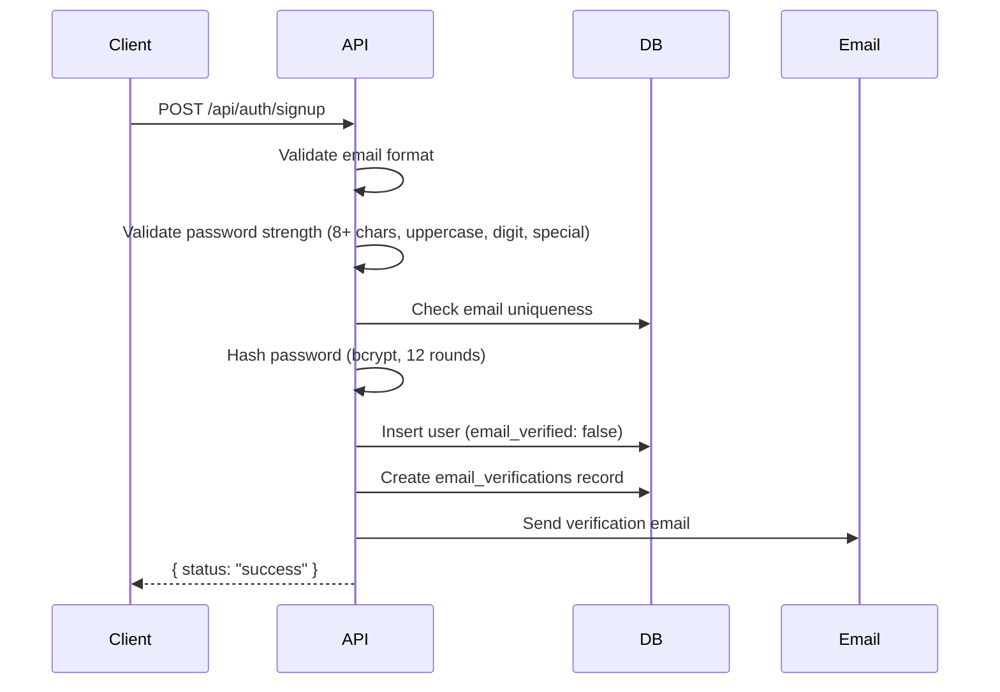
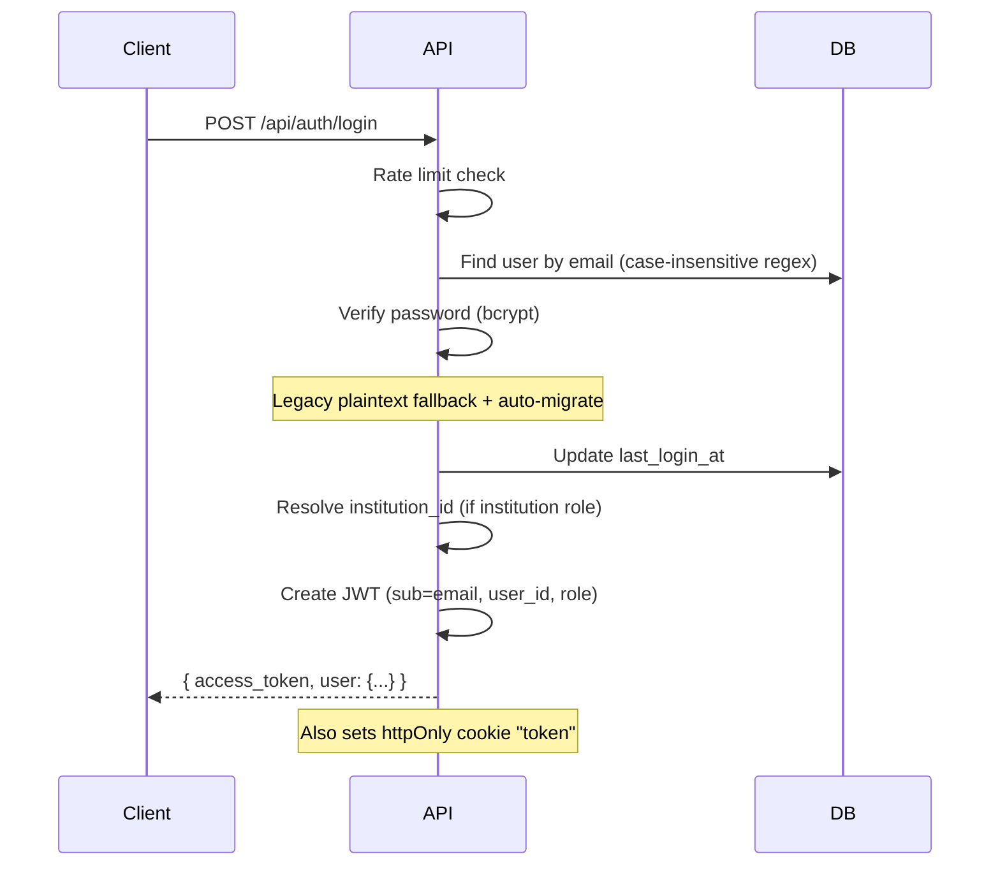

# BACKEND_MIGRATION_REFERENCE.md
# Studlyf — FastAPI → Node.js + TypeScript Migration Engineering Reference

> **Document Status:** Production-Grade Reference  
> **Generated:** 2026-08-01  
> **Scope:** Complete architecture audit of the existing FastAPI backend  
> **Classification:** Engineering — Internal Use Only

---

## Table of Contents

1. [Project Overview](#section-1-project-overview)
2. [Complete API Inventory](#section-2-complete-api-inventory)
3. [Router Map](#section-3-router-map)
4. [Authentication System](#section-4-authentication-system)
5. [Authorization Matrix](#section-5-authorization-matrix)
6. [Database Analysis](#section-6-database-analysis)
7. [Service Layer](#section-7-service-layer)
8. [Environment Variables](#section-8-environment-variables)
9. [External Integrations](#section-9-external-integrations)
10. [Frontend ↔ Backend Contracts](#section-10-frontend--backend-contracts)
11. [File Upload System](#section-11-file-upload-system)
12. [Known Technical Debt](#section-12-known-technical-debt)
13. [Risk Analysis](#section-13-risk-analysis)
14. [Migration Difficulty Assessment](#section-14-migration-difficulty-assessment)
15. [Recommended Node.js Architecture](#section-15-recommended-nodejs-architecture)

---

## Section 1: Project Overview

### 1.1 Current Backend Architecture

| Aspect | Detail |
|--------|--------|
| **Framework** | FastAPI (Python) |
| **Runtime** | Python 3.x on Uvicorn / Gunicorn |
| **Database** | MongoDB (Atlas) via Motor (async driver) |
| **Authentication** | JWT (HS256) via PyJWT + bcrypt |
| **Email** | SMTP (smtplib, SSL port 465) |
| **AI** | Groq API (LLaMA 3.3-70b-versatile) |
| **File Storage** | Local filesystem (`/uploads`, `/static`, `/artifacts/certs`) + GridFS (MongoDB) |
| **Background Tasks** | APScheduler (asyncio) + asyncio.create_task |
| **Rate Limiting** | slowapi + custom MemoryRateLimiter (Redis optional) |
| **Monitoring** | Sentry SDK |
| **Caching** | In-memory dict (HTML cache), per-query result caches |
| **Payments** | Razorpay |
| **Templating** | Jinja2 (HTML templates for SSR portals, certificates, emails) |
| **Deployment** | Render (Docker), with nginx reverse proxy config |
| **Frontend** | React + TypeScript + Vite (hash-based routing) |

### 1.2 Major Modules

| Module | Description |
|--------|-------------|
| **Auth** | Signup, Login, JWT, Email verification, Password reset, Role management |
| **Institution Dashboard** | Full institution management — events, participants, teams, judges, submissions, leaderboard, certificates, analytics |
| **Events/Hackathons** | Multi-stage event workflow with registration, quizzes, submissions, judging, leaderboard |
| **Opportunities** | Job/internship/hackathon listings with applications, reviews, saved items |
| **Company Simulator** | Company prep modules with AI-driven scenarios |
| **Career Dreamer** | AI-powered career analysis, identity mapping, roadmaps, certifications |
| **Mock Interview** | Multi-round AI interview simulation with voice analysis |
| **Courses & LMS** | Course marketplace, modules, quizzes, projects, certificates, enrollment |
| **SDL (System Deconstruction Lab)** | Collaborative engineering project platform |
| **Resume Builder** | AI-powered resume generation with PDF output |
| **Notifications** | In-app + email notification system with template engine |
| **Admin Panel** | Super admin dashboard for platform management |
| **Community** | Project showcase, voting, comments (Product Hunt-style) |
| **StudOTT** | Educational video streaming platform |
| **Skill Assessment** | AI-powered skill evaluation with detailed reports |
| **Certificates** | Event & course certificate generation, verification, and QR codes |
| **Gamification** | Badges, leaderboards, XP tracking |
| **Teams** | Team formation, invite codes, join requests |

### 1.3 Folder Organization

```
studlyfv2/
├── backend/
│   ├── main.py                          # 7,793 lines — Monolith entry point + ~100 endpoints
│   ├── integration_routes.py            # 378KB — Institution dashboard API (~150 endpoints)
│   ├── hackathon_integration_routes.py  # 45KB — Hackathon-specific integration
│   ├── db.py                            # Database manager + 80+ collection references
│   ├── domain_models.py                 # Pydantic models (658 lines)
│   ├── auth_utils.py                    # JWT + bcrypt utilities
│   ├── auth_institution.py              # Institution-scoped JWT helpers
│   ├── rate_limiter.py                  # Rate limiting (Redis + memory fallback)
│   ├── stage_access_control.py          # Stage submission eligibility logic (1,216 lines)
│   ├── security_fixes.py               # Security hardening module
│   ├── secured_endpoints.py            # Reference secured endpoint implementations
│   ├── notification_service.py          # In-app notification service
│   ├── notification_helpers.py          # Notification utility functions
│   ├── database_indexes.py             # Index management
│   ├── routes/                          # 41 route files
│   │   ├── auth.py                      # get_current_user + require_role
│   │   ├── opportunity_routes.py        # /api/opportunities
│   │   ├── event_routes.py              # /api/v1/events
│   │   ├── registration_flow_routes.py  # /api/v1/registration (72KB)
│   │   ├── team_routes.py               # /api/teams
│   │   ├── submission_routes.py         # /api/submissions
│   │   ├── judge_routes.py              # /api/judges + /api/judge-portal
│   │   ├── notification_routes.py       # /api/notifications
│   │   ├── evaluation_routes.py         # /api/evaluation
│   │   ├── stage_navigation_routes.py   # /api/v1/stages
│   │   ├── hackathon_judging_routes.py  # /api/judging
│   │   ├── hackathon_submission_routes.py # /api/hackathons
│   │   ├── community_routes.py          # /api/community
│   │   ├── student_features_routes.py   # /api/student
│   │   ├── company_simulator.py         # /api/company-simulator
│   │   ├── skill_assessment_controller.py # /api/skill-assessment
│   │   ├── certificate_*_routes.py      # /api/v1/certificates/*
│   │   ├── achievement_registry_routes.py # /api/v1/institution/certificates
│   │   ├── course_projects_routes.py    # /api (course project endpoints)
│   │   ├── studott_routes.py            # StudOTT video platform
│   │   └── ... (41 files total)
│   ├── services/                        # 49 service files
│   │   ├── email_service.py             # SMTP email delivery (56KB)
│   │   ├── email_template_service.py    # HTML email templates (74KB)
│   │   ├── opportunity_service.py       # Opportunity CRUD + applications (46KB)
│   │   ├── stage_service.py             # Stage management (33KB)
│   │   ├── team_service.py              # Team operations (21KB)
│   │   ├── judge_service.py             # Judge invitation + management (29KB)
│   │   ├── registration_service.py      # Registration business logic (26KB)
│   │   ├── career_taxonomy.py           # Career path taxonomy data (100KB)
│   │   ├── subscription_service.py      # Plan/quota enforcement (18KB)
│   │   ├── institutional_certificate_service.py # Certificate PDF gen (39KB)
│   │   └── ... (49 files total)
│   ├── models/                          # 7 Pydantic model files
│   ├── utils/                           # Cache, DB helpers, profiler
│   ├── templates/                       # 15 Jinja2 HTML templates
│   └── static/                          # Static assets
├── frontend/                            # React + TypeScript + Vite
│   ├── App.tsx                          # Core routing (~650 lines)
│   ├── AuthContext.tsx                  # Auth provider + JWT management
│   ├── apiConfig.ts                     # API base URL resolution
│   ├── pages/                           # 59 page components + 7 subdirectories
│   ├── components/                      # Reusable UI components
│   ├── contexts/                        # React contexts
│   └── hooks/                           # Custom hooks
└── .env.example                         # Environment variable reference
```

### 1.4 Dependencies (requirements.txt)

| Category | Packages |
|----------|----------|
| **Web Framework** | fastapi, uvicorn, starlette, pydantic |
| **Database** | motor, pymongo |
| **Auth/Security** | PyJWT, bcrypt, passlib, cryptography |
| **Firebase** | firebase-admin, google-auth, google-cloud-* |
| **File Processing** | python-multipart, pdfplumber, PyPDF2, python-docx, Pillow, reportlab, weasyprint |
| **Email** | aiosmtplib, smtplib (stdlib) |
| **AI** | groq |
| **HTTP** | httpx, requests |
| **Scheduling** | APScheduler |
| **Rate Limiting** | slowapi, limits, redis |
| **Caching** | redis |
| **Templating** | jinja2 |
| **Monitoring** | sentry-sdk, python-json-logger |
| **Payments** | razorpay |
| **HTML Parsing** | beautifulsoup4, lxml |
| **Utilities** | qrcode, Markdown, markdown2, certifi |
| **Testing** | pytest, pytest-asyncio, pytest-cov |
| **Production** | gunicorn |

---

## Section 2: Complete API Inventory

### 2.1 Auth Endpoints (main.py)

| Method | Route | Purpose | Auth | Roles | Request Body | Response |
|--------|-------|---------|------|-------|-------------|----------|
| `POST` | `/api/auth/signup` | User registration | ❌ | Public | `UserSignup { email, password, full_name, role, institution_name?, college_name?, graduation_year? }` | `{ status, message }` |
| `POST` | `/api/auth/login` | User login + JWT issuance | ❌ | Public | `UserLogin { email, password }` | `{ access_token, token_type, user: { email, full_name, role, user_id, institution_id, ... } }` + httpOnly cookie |
| `POST` | `/api/auth/verify-email` | Email verification | ❌ | Public | `{ token }` | `{ status, message }` |
| `POST` | `/api/auth/resend-verification` | Resend verification email | ❌ | Public | `{ email }` | `{ status, message }` |
| `POST` | `/api/auth/forgot-password` | Password reset request | ❌ | Public | `{ email }` | `{ status, message }` |
| `POST` | `/api/auth/reset-password` | Password reset with token | ❌ | Public | `{ token, password }` | `{ status, message }` |
| `GET` | `/api/auth/me` | Get current user profile | ✅ | Any | — | `{ email, full_name, role, user_id, institution_id, ... }` |
| `POST` | `/api/v1/auth/promote-to-institution` | Promote user to institution role | ✅ | admin, super_admin | `{ user_id }` | `{ status }` |

### 2.2 User Profile Endpoints (main.py)

| Method | Route | Purpose | Auth | DB Tables |
|--------|-------|---------|------|-----------|
| `GET` | `/api/user/{user_id}/profile` | Get user profile | ❌ | users, user_profiles, learner_profiles |
| `GET` | `/api/user/{user_id}` | Get user (alias) | ❌ | users |
| `POST` | `/api/user/{user_id}/update-profile` | Update user profile | ✅ | users, user_profiles |
| `DELETE` | `/api/user/{user_id}/profile/skill/{skill_index}` | Remove skill | ✅ | users |
| `DELETE` | `/api/user/{user_id}/profile/project/{project_index}` | Remove project | ✅ | users |
| `DELETE` | `/api/user/{user_id}/profile/certification/{cert_index}` | Remove cert | ✅ | users |
| `DELETE` | `/api/user/{user_id}/profile/achievement/{ach_index}` | Remove achievement | ✅ | users |
| `DELETE` | `/api/user/{user_id}/profile/education/{edu_index}` | Remove education | ✅ | users |
| `DELETE` | `/api/user/{user_id}/profile/experience/{exp_index}` | Remove experience | ✅ | users |
| `GET` | `/api/user/{user_id}/badges` | Get user badges | ❌ | users |
| `GET` | `/api/user/{user_id}/dashboard-stats` | Learner dashboard stats | ❌ | users, certificates, enrollments, progress, submissions |
| `POST` | `/api/user/{user_id}/upload-resume` | Upload resume file | ✅ | resumes, users |
| `PATCH` | `/api/users/{user_id}/role` | Update user role | ✅ | users |

### 2.3 Course & LMS Endpoints (main.py)

| Method | Route | Purpose | Auth |
|--------|-------|---------|------|
| `GET` | `/api/courses` | List all courses | ❌ |
| `GET` | `/api/courses/{course_id}/modules` | Get course modules | ❌ |
| `GET` | `/api/modules/{module_id}` | Get module details | ❌ |
| `GET` | `/api/course/{course_id}/details` | Full course details | ❌ |
| `POST` | `/api/progress/update` | Update learning progress | ✅ |
| `GET` | `/api/company-prep/progress` | Company prep progress | ✅ |
| `POST` | `/api/company-prep/progress` | Update company prep | ✅ |
| `POST` | `/api/quiz/submit` | Submit quiz answers | ✅ |
| `POST` | `/api/project/submit` | Submit project | ✅ |
| `GET` | `/api/certificates/{user_id}` | User certificates | ❌ |
| `GET` | `/api/certificates/{user_id}/{cert_id}/html` | Cert HTML preview | ❌ |

### 2.4 Cart & Enrollment Endpoints (main.py)

| Method | Route | Purpose | Auth |
|--------|-------|---------|------|
| `GET` | `/api/cart/{user_id}` | Get cart | ❌ |
| `POST` | `/api/cart/{user_id}/add` | Add to cart | ❌ |
| `DELETE` | `/api/cart/{user_id}/remove/{course_id}` | Remove from cart | ❌ |
| `DELETE` | `/api/cart/{user_id}/clear` | Clear cart | ❌ |
| `POST` | `/api/checkout/{user_id}` | Checkout | ❌ |
| `POST` | `/api/enrollment-flow/confirm/{user_id}` | Confirm enrollment | ❌ |
| `DELETE` | `/api/enrollment/{user_id}/{course_id}` | Unenroll | ❌ |
| `GET` | `/api/enrollments/{user_id}` | List enrollments | ❌ |
| `GET` | `/api/user-courses/{user_id}` | User courses (detailed) | ❌ |
| `POST` | `/api/enroll` | Quick enroll | ✅ |

### 2.5 AI & Career Endpoints (main.py)

| Method | Route | Purpose | Auth | AI Service |
|--------|-------|---------|------|------------|
| `POST` | `/api/resume/review` | AI resume review | ❌ | Groq |
| `POST` | `/api/assessment/generate` | Generate assessment | ❌ | Groq |
| `POST` | `/api/analyze-github` | GitHub profile analysis | ❌ | Groq |
| `POST` | `/api/generate-summary/` | AI summary generation | ❌ | Groq |
| `POST` | `/generate-resume/` | Generate resume PDF | ❌ | Groq |
| `POST` | `/generate-portfolio/` | Generate portfolio | ❌ | Groq |
| `POST` | `/api/career/analyze` | Career analysis | ❌ | Groq |
| `POST` | `/api/career/explain` | Career explanation | ❌ | Groq |
| `POST` | `/api/career/path-details` | Career path details | ❌ | Groq |
| `POST` | `/api/career/identity` | Career identity mapping | ❌ | Groq |
| `POST` | `/api/career/explore-paths` | Explore career paths | ❌ | Groq |
| `POST` | `/api/career/roadmap` | Career roadmap | ❌ | Groq |
| `POST` | `/api/career/certifications` | Career certifications | ❌ | Groq |
| `POST` | `/api/career/insight-details` | Career insight details | ❌ | Groq |
| `GET` | `/api/ai-tools` | List AI tools | ❌ | Web scraping |

### 2.6 Mock Interview Endpoints (main.py)

| Method | Route | Purpose | Auth | AI |
|--------|-------|---------|------|----|
| `POST` | `/api/interview/setup` | Start interview session | ✅ | Groq |
| `POST` | `/api/interview/chat` | Interview conversation | ✅ | Groq |
| `POST` | `/api/interview/voice-analysis` | Analyze voice response | ✅ | Groq |
| `GET` | `/api/interview/report` | Interview report | ✅ | — |

### 2.7 Admin Endpoints (main.py)

| Method | Route | Purpose | Auth |
|--------|-------|---------|------|
| `GET` | `/api/admin/stats` | Platform stats | ✅ (admin_required) |
| `GET` | `/api/admin/students` | List students | ✅ (admin_required) |
| `POST` | `/api/admin/register-student` | Register student | ✅ (admin_required) |
| `POST` | `/api/admin/restrict-student` | Restrict student | ✅ (admin_required) |
| `POST` | `/api/admin/upload-certificate` | Upload certificate | ✅ (admin_required) |
| `POST` | `/api/admin/upload-image` | Upload image | ✅ (admin_required) |
| `GET/POST/PUT/DELETE` | `/api/admin/courses/*` | CRUD courses | ✅ (admin_required) |
| `GET` | `/api/admin/hiring` | Hiring data | ✅ (admin_required) |
| `GET` | `/api/admin/assessments` | Assessment history | ✅ (admin_required) |
| `GET` | `/api/admin/quizzes` | Quiz management | ✅ (admin_required) |
| `GET/POST` | `/api/admin/submissions/*` | Submission management | ✅ (admin_required) |
| `GET` | `/api/admin/insights` | Platform insights | ✅ (admin_required) |
| `GET/POST` | `/api/admin/mentors` | Mentor management | ✅ (admin_required) |
| `GET/POST` | `/api/admin/companies` | Company management | ✅ (admin_required) |
| `GET` | `/api/admin/payments` | Payment history | ✅ (admin_required) |
| `GET` | `/api/admin/audit-logs` | Audit trail | ✅ (admin_required) |
| `GET` | `/api/admin/resumes` | Resume management | ✅ (admin_required) |
| `GET/POST/PUT/DELETE` | `/api/admin/sdl/*` | SDL management | ✅ (admin_required) |
| `GET/POST/DELETE` | `/api/admin/cert-templates` | Cert templates | ✅ (admin_required) |
| `POST` | `/api/admin/events/{id}/certificates/issue` | Issue certs | ✅ (admin_required) |

### 2.8 SDL (System Deconstruction Lab) Endpoints (main.py)

| Method | Route | Purpose | Auth |
|--------|-------|---------|------|
| `GET` | `/api/sdl/projects` | List projects | ❌ |
| `GET` | `/api/sdl/projects/{project_id}` | Project detail | ❌ |
| `POST` | `/api/sdl/projects` | Create project | ✅ |
| `PUT` | `/api/sdl/projects/{project_id}` | Update project | ✅ |
| `POST` | `/api/sdl/tasks` | Create task | ✅ |
| `PUT` | `/api/sdl/tasks/{task_id}` | Update task | ✅ |
| `POST` | `/api/sdl/comments` | Add comment | ✅ |
| `POST` | `/api/sdl/join-requests` | Join request | ✅ |
| `PUT` | `/api/sdl/join-requests/{request_id}` | Handle request | ✅ |
| `GET` | `/api/sdl/user/{user_id}/projects` | User projects | ❌ |
| `GET` | `/api/sdl/stats` | Platform stats | ❌ |

### 2.9 Ads Management (main.py)

| Method | Route | Purpose | Auth |
|--------|-------|---------|------|
| `GET` | `/api/ads` | Active ads | ❌ |
| `GET` | `/api/ads/all` | All ads | ✅ (admin) |
| `POST` | `/api/ads` | Create ad | ✅ (admin) |
| `PUT` | `/api/ads/{ad_id}` | Update ad | ✅ (admin) |
| `DELETE` | `/api/ads/{ad_id}` | Delete ad | ✅ (admin) |
| `PATCH` | `/api/ads/{ad_id}/toggle` | Toggle ad | ✅ (admin) |

### 2.10 Router-Based Endpoints (41 route files)

#### Opportunities (`/api/opportunities`)
- `POST /` — Create opportunity
- `GET /` — List opportunities (public, filtered)
- `GET /{id}` — Opportunity detail
- `PUT /{id}` — Update opportunity
- `DELETE /{id}` — Delete opportunity
- `POST /{id}/apply` — Apply
- `GET /my-applications` — User's applications
- `GET /{id}/applications` — Institution: view applicants
- `POST /{id}/review` — Submit review
- `GET /{id}/reviews` — Get reviews
- `POST /{id}/save` — Save opportunity
- `DELETE /{id}/save` — Unsave
- `GET /saved` — Saved list
- `GET /overview` — Learner opportunity overview

#### Events (`/api/v1/events`)
- `POST /` — Create event
- `GET /` — List events
- `GET /{id}` — Event detail
- `PUT /{id}` — Update event
- `DELETE /{id}` — Delete event
- `PATCH /{id}/status` — Update status
- `POST /{id}/upload-media` — Upload event media
- `GET /{id}/stages` — Event stages
- `POST /{id}/stages` — Create stage
- `PUT /{id}/stages/{stage_id}` — Update stage
- `DELETE /{id}/stages/{stage_id}` — Delete stage

#### Registration (`/api/v1/registration`)
- `POST /events/{id}/register` — Register for event
- `GET /events/{id}/check` — Check registration status
- `GET /events/{id}/team-info` — Team info for event
- Full stage submission workflows with file upload

#### Teams (`/api/teams`)
- `POST /create` — Create team
- `POST /{id}/join` — Join team via code
- `GET /{id}` — Team detail
- `GET /event/{event_id}` — Teams for event
- `PATCH /{id}/members` — Update members

#### Submissions (`/api/submissions`)
- `POST /` — Create submission
- `GET /event/{event_id}` — Event submissions
- `GET /{id}` — Submission detail
- `PUT /{id}` — Update submission

#### Judges (`/api/judges` + `/api/judge-portal`)
- `POST /invite` — Invite judge
- `GET /event/{event_id}` — Event judges
- `POST /accept-invitation` — Accept invitation
- `POST /evaluate` — Submit evaluation
- `GET /my-assignments` — Judge's assignments

#### Notifications (`/api/notifications`)
- `GET /` — User notifications
- `POST /mark-read` — Mark as read
- `POST /mark-all-read` — Mark all as read
- `GET /unread-count` — Unread count

#### Community (`/api/community`)
- `GET /posts` — List posts
- `POST /posts` — Create post
- `GET /posts/{id}` — Post detail
- `POST /posts/{id}/vote` — Vote
- `POST /posts/{id}/comments` — Comment
- `GET /top-builders` — Leaderboard

#### Skill Assessment (`/api/skill-assessment`)
- `POST /save` — Save assessment
- `GET /history/{user_id}` — Assessment history
- `GET /{assessment_id}` — Assessment detail

#### Institution Dashboard (`/api/v1/institution` — integration_routes.py, ~150+ endpoints)

This is the largest single route file (378KB). Major endpoint groups:

- **Profile**: `POST /profile`, `GET /profile/{id}`, `GET /profile/{id}/branding`
- **Events CRUD**: `GET /events/{id}`, `DELETE /events/{id}`, `PATCH /events/{id}`
- **Event Creation**: `POST /events/create-professional`
- **Participants**: `GET /events/{id}/participants`, `POST /participants/add`
- **Teams**: `GET /events/{id}/teams`, `DELETE /events/{id}/teams/{id}`, `PATCH /events/{id}/teams/{id}/status`
- **Submissions**: `GET /events/{id}/submissions`, `POST /create_submission`
- **Judges**: `POST /events/{id}/judges`, `DELETE /events/{id}/judges/{email}`, `POST /judge/score`, `GET /judge/my-assignments`
- **Leaderboard**: `GET /leaderboard/{id}`, `POST /leaderboard/{id}/refresh`, `GET /leaderboard/{id}/export-pdf`
- **Certificates**: `POST /events/{id}/certificates/issue-ranked`, `GET /institution/certificates/{id}`
- **Quizzes**: `GET /events/{id}/quizzes`, `POST /events/{id}/quizzes`, `POST /events/{id}/quizzes/{id}/submit`
- **Stages**: `POST /events/{id}/stages`, `PUT /events/{id}/stages/{id}`, `PATCH /events/{id}/advance-stage`
- **Email Templates**: `GET/POST/DELETE/PATCH /events/{id}/email-templates/*`
- **Analytics**: `GET /analytics/{id}/timeline`, `GET /analytics/{id}/departments`, `GET /analytics/{id}/score-distribution`
- **FAQs**: `GET/POST/PUT/DELETE /events/{id}/faqs/*`
- **Notifications**: `GET /notifications/{id}`, `POST /notifications/{id}/mark-read`
- **Bulk Operations**: `POST /events/{id}/bulk-notify`, `POST /members/bulk`
- **Export**: `GET /export-summary/{id}`, `GET /export-participants/{id}`
- **Avatars**: `GET/POST/DELETE /avatars`
- **Search**: `GET /search`

#### Hackathon Routes (`/api/judging`, `/api/hackathons`, `/api/v1/hackathons`)
- Problem statement management
- Submission with team/solo modes
- Judge assignment and scoring
- Rubric-based evaluation
- Public event listing

---

## Section 3: Router Map

### 3.1 Router Hierarchy

```
FastAPI App (main.py)
├── Direct endpoints (~100 routes defined in main.py)
│
├── app.include_router(skill_assessment_router)
│   └── prefix: /api/skill-assessment
│
├── app.include_router(certificate_template_router)
│   └── prefix: /api/v1/certificates/templates
│
├── app.include_router(submission_routes.router)
│   └── prefix: /api/submissions
│
├── app.include_router(judge_routes.router)
│   └── prefix: /api/judges
│
├── app.include_router(judge_routes.portal_router)
│   └── prefix: /api/judge-portal
│
├── app.include_router(event_routes.router)
│   └── prefix: /api/v1/events
│
├── app.include_router(dashboard_routes.router)
│   └── prefix: /api/institution/dashboard
│
├── app.include_router(integration_routes.router)
│   └── prefix: /api/v1/institution (mounted in main.py)
│
├── app.include_router(opportunity_routes.router)
│   └── prefix: /api/opportunities
│
├── app.include_router(team_routes.router)
│   └── prefix: /api/teams
│
├── app.include_router(evaluation_routes.router)
│   └── prefix: /api/evaluation
│
├── app.include_router(evaluation_criteria_routes.router)
│   └── prefix: /api/evaluation-criteria
│
├── app.include_router(quiz_visibility_routes.router)
│   └── prefix: /api/quiz-visibility
│
├── app.include_router(notification_routes.router)
│   └── prefix: /api/notifications
│
├── app.include_router(team_formation_routes.router)
│   └── prefix: /api/team-formation
│
├── app.include_router(stage_sync_routes.router)
│   └── prefix: /api/stage-sync
│
├── app.include_router(direct_sync_routes.router)
│   └── prefix: /api/direct-sync
│
├── app.include_router(hackathon_judging_routes.router)
│   └── prefix: /api/judging
│
├── app.include_router(hackathon_submission_routes.router)
│   └── prefix: /api/hackathons
│
├── app.include_router(stage_navigation_routes.router)
│   └── prefix: /api/v1/stages
│
├── app.include_router(team_join_request_routes.router)
│   └── prefix: /api/v1/teams/requests
│
├── app.include_router(student_features_routes.router)
│   └── prefix: /api/student
│
├── app.include_router(hackathon_integration_routes.router)
│   └── prefix: (defined in hackathon_integration_routes.py)
│
├── app.include_router(hackathon_public_routes.router)
│   └── prefix: /api/v1/hackathons
│
├── app.include_router(participant_card_routes.router)
│   └── prefix: (participant card endpoints)
│
├── app.include_router(participant_card_admin_router)
│   └── prefix: /api/v1/institution/events
│
├── app.include_router(event_certificate_routes.router)
│   └── prefix: /api/v1/events (certificate sub-routes)
│
├── app.include_router(event_certificate_routes.verification_router)
│   └── prefix: /api/v1/verify
│
├── app.include_router(achievement_registry_routes.router)
│   └── prefix: /api/v1/institution/certificates
│
├── app.include_router(eligibility_rule_routes.router)
│   └── prefix: /api/v1/certificates/rules
│
├── app.include_router(registration_flow_routes.router)
│   └── prefix: /api/v1/registration
│
├── app.include_router(stage_endpoints.router)
│   └── prefix: /api/v1/events (stage sub-routes)
│
├── app.include_router(company_simulator.router)
│   └── prefix: /api/company-simulator (mounted in main.py)
│
├── app.include_router(community_routes.community_router)
│   └── prefix: /api/community
│
├── app.include_router(course_projects_routes.course_projects_router)
│   └── prefix: /api
│
└── app.include_router(studott_routes.router)
    └── prefix: (studott endpoints)
```

### 3.2 SSR / HTML Routes (main.py)

| Route | Purpose |
|-------|---------|
| `/portal/{event_id}` | Public event portal (SSR HTML) |
| `/card/{event_id}` | Participant card page (SSR HTML) |
| `/card.html` | Card compatibility route |
| `/admin` | Admin HTML page (auth required) |
| `/view/{filename}` | View generated portfolio file |
| `/download-resume/{filename}` | Download generated resume |

### 3.3 Static File Mounts

| Mount Path | Directory | Purpose |
|------------|-----------|---------|
| `/static` | `backend/static/` | Static assets |
| `/uploads` | `backend/uploads/` | Temporary uploads |
| `/certificates` | `backend/artifacts/certs/` | Generated certificate PDFs |

---

## Section 4: Authentication System

### 4.1 Overview

The system uses **JWT (JSON Web Tokens)** with **HS256** algorithm. Passwords are hashed with **bcrypt** (12 rounds).

### 4.2 Auth Flow — Signup



### 4.3 Auth Flow — Login



### 4.4 JWT Token Structure

```json
{
  "sub": "user@email.com",
  "user_id": "uuid-v4-string",
  "role": "student|institution|admin|super_admin|judge",
  "exp": 1234567890
}
```

**Configuration:**
- Secret: `JWT_SECRET` (env, min 32 chars)
- Algorithm: `HS256`
- Expiry: `ACCESS_TOKEN_EXPIRE_MINUTES` (default 1440 = 24h)
- Cookie: `token` (httpOnly, secure in prod, samesite=lax, 7-day max-age)

### 4.5 Auth Middleware/Dependencies

| Function | Location | Purpose |
|----------|----------|---------|
| `get_current_user(request)` | `routes/auth.py` | Extract JWT from `Authorization: Bearer <token>` header |
| `require_role(allowed_roles)` | `routes/auth.py` | Role-based access control dependency |
| `get_auth_user(request)` | `auth_institution.py` | Enhanced JWT extraction (header, query, cookie) + DB hydration |
| `get_auth_user_optional(request)` | `auth_institution.py` | Optional auth (returns None if no token) |
| `admin_required(x_admin_email)` | `main.py` | Legacy admin check via `X-Admin-Email` header |
| `assert_institution_scope(inst_id, user)` | `auth_institution.py` | Verify institution ownership |
| `assert_institution_owns_event(event_id, user)` | `auth_institution.py` | Verify event ownership |

### 4.6 Email Verification

- Token: `secrets.token_urlsafe(32)`
- Storage: `email_verifications` collection
- Expiry: 24 hours
- Link format: `{FRONTEND_URL}/#/verify-email?token={token}`

### 4.7 Password Reset

- Token: `secrets.token_urlsafe(32)` + SHA256 hash
- Storage: `password_resets` collection
- Expiry: 1 hour
- Link format: `{FRONTEND_URL}/#/reset-password?token={token}`

### 4.8 Session Handling (Frontend)

- JWT stored in `localStorage` key `auth_token`
- Fallback to `sessionStorage` for incognito mode
- Auth state checked on app load via `GET /api/auth/me`
- httpOnly cookie `token` as fallback for credential-mode requests

---

## Section 5: Authorization Matrix

### 5.1 Role Definitions

| Role | Internal Value | Description |
|------|---------------|-------------|
| **Student** | `student` | Regular learner/participant |
| **Institution** | `institution` | Institution administrator |
| **Admin** | `admin` | Platform admin |
| **Super Admin** | `super_admin` | Full platform control |
| **Judge** | `judge` | Event evaluator (JWT-based, may not have users_col record) |
| **Mentor** | `mentor` | Course mentor |
| **Hiring Partner** | `hiring_partner` | Recruitment partner |

### 5.2 Permissions Matrix

| Feature Area | Student | Institution | Admin/Super Admin | Judge | Public |
|-------------|---------|-------------|-------------------|-------|--------|
| **Auth (signup/login)** | — | — | — | — | ✅ |
| **View courses** | ✅ | ✅ | ✅ | ❌ | ✅ |
| **Enroll in courses** | ✅ | ❌ | ❌ | ❌ | ❌ |
| **Resume builder** | ✅ | ❌ | ❌ | ❌ | ❌ |
| **Mock interview** | ✅ | ❌ | ❌ | ❌ | ❌ |
| **Career assessment** | ✅ | ❌ | ❌ | ❌ | ❌ |
| **Skill assessment** | ✅ | ❌ | ❌ | ❌ | ❌ |
| **View opportunities** | ✅ | ✅ | ✅ | ❌ | ✅ |
| **Apply for opportunities** | ✅ | ❌ | ❌ | ❌ | ❌ |
| **Create opportunities** | ❌ | ✅ | ✅ | ❌ | ❌ |
| **Register for events** | ✅ | ❌ | ❌ | ❌ | ❌ |
| **Create events** | ❌ | ✅ | ✅ | ❌ | ❌ |
| **Manage events** | ❌ | ✅ (own) | ✅ (all) | ❌ | ❌ |
| **Manage participants** | ❌ | ✅ (own events) | ✅ | ❌ | ❌ |
| **Invite judges** | ❌ | ✅ | ✅ | ❌ | ❌ |
| **Evaluate submissions** | ❌ | ❌ | ❌ | ✅ | ❌ |
| **View leaderboard** | ✅ | ✅ | ✅ | ✅ | ✅ |
| **Issue certificates** | ❌ | ✅ | ✅ | ❌ | ❌ |
| **Admin panel** | ❌ | ❌ | ✅ | ❌ | ❌ |
| **Manage users** | ❌ | ❌ | ✅ | ❌ | ❌ |
| **SDL projects** | ✅ | ❌ | ✅ | ❌ | ✅ (read) |
| **Community posts** | ✅ | ✅ | ✅ | ❌ | ✅ (read) |
| **Upload files** | ✅ | ✅ | ✅ | ❌ | ❌ |

---

## Section 6: Database Analysis

### 6.1 Database Engine

**MongoDB** (Atlas cloud) via **Motor** (async Python driver).

- Connection: `AsyncIOMotorClient` with TLS (certifi)
- Database name: `DB_NAME` env var (default: `studlyf_db`)
- GridFS: `stage_files` bucket for persistent file storage

### 6.2 Complete Collection Registry (80+ collections)

#### Academic Core
| Collection | Purpose | Key Indexes |
|-----------|---------|-------------|
| `courses` | Course catalog | — |
| `modules` | Course modules | — |
| `theories` | Module theory content | — |
| `videos` | Module video content | — |
| `quizzes` | Quiz questions | `event_id` |
| `projects` | Project assignments | — |
| `progress` | Learner progress tracking | — |

#### Identity & Marketplace
| Collection | Purpose | Key Indexes |
|-----------|---------|-------------|
| `users` | User accounts | `user_id` (unique), `email` (unique) |
| `user_profiles` | Extended profiles | `user_id` (unique) |
| `learner_profiles` | Learner-specific data | `user_id` (unique) |
| `cart` | Shopping cart | — |
| `enrollments` | Course enrollments | — |
| `resumes` | Stored resumes | — |
| `certificates` | Course certificates | — |
| `event_certificates` | Event certificates | `(event_id, user_id, achievement_key)` (unique) |
| `certificate_jobs` | Cert generation queue | — |

#### Career & Operations
| Collection | Purpose | Key Indexes |
|-----------|---------|-------------|
| `interviews` | Mock interview sessions | — |
| `mentors` | Mentor profiles | — |
| `companies` | Company profiles | — |
| `skill_assessments` | Skill assessment results | — |
| `advertisements` | Platform ads | — |
| `payments` | Payment records | — |
| `audit_logs` | Audit trail | — |
| `reports` | Generated reports | `(event_id, type)`, `(institution_id, type)` |

#### Institution Dashboard
| Collection | Purpose | Key Indexes |
|-----------|---------|-------------|
| `institutions` | Institution profiles | `name` (unique), `institution_id` (unique), `email` (unique, sparse) |
| `events` | Events/hackathons | `event_id` (unique, sparse), `(institution_id, status)`, `(institution_id, created_at)` |
| `event_faqs` | Event FAQs | — |
| `rounds` | Dynamic phases | — |
| `form_fields` | Form builder data | — |
| `participants` | Event participants | `(event_id, user_id)` (unique), `event_id`, `team_id`, `(institution_id, event_id)` |
| `teams` | Event teams | `(event_id, team_name)` (unique), `team_leader_id`, `invite_code` (unique, sparse) |
| `submissions` | Event submissions | `event_id`, `(event_id, status)` |
| `submission_data` | Stage submissions (KV) | `(event_id, stage_id, user_id)` (unique), `(event_id, stage_id, team_id)` (unique) |
| `judges` | Judge profiles | — |
| `event_judges` | Event-judge assignments | — |
| `scores` | Evaluation scores | `event_id`, `submission_id`, `(event_id, submission_id)` |
| `evaluation_criteria` | Rubric definitions | — |
| `rubrics` | Hackathon rubrics | — |
| `submission_scores` | Detailed rubric scores | — |
| `notifications` | In-app notifications | `(user_id, is_read)`, `event_id` |
| `messages` | Direct messages | `(user_id, is_read)`, `event_id` |
| `leaderboard` | Rankings | `(event_id, score)`, `(event_id, rank)` |
| `results` | Final results | — |
| `workflow_states` | State machine | — |
| `achievements` | User achievements | `(user_id, type)`, `(event_id, type)` |

#### Opportunities & Career
| Collection | Purpose | Key Indexes |
|-----------|---------|-------------|
| `opportunities` | Job/hackathon listings | `(institution_id, status)`, `status`, `createdBy`, `event_link_id` |
| `opportunity_applications` | Applications | `opportunity_id`, `user_id`, `(opportunity_id, user_id)` |
| `opportunity_reviews` | Reviews | `opportunity_id` |
| `saved_opportunities` | Saved listings | `(user_id, opportunity_id)` (unique) |
| `career_assessments` | Career assessments | — |
| `career_goals` | User goals | — |
| `assessment_questions` | Question bank | — |
| `career_assessment_templates` | Assessment templates | — |

#### Email & Notifications
| Collection | Purpose | Key Indexes |
|-----------|---------|-------------|
| `email_templates` | Custom email templates | `(event_id, type)`, `(institution_id, type)` |
| `opportunity_emails_log` | Email audit | `(user_id, event_id)`, `event_id` |
| `email_queue` | Queued emails | `(status, attempts)`, `idempotency_key` (sparse) |
| `email_delivery_logs` | Delivery logs | `(recipient, status)`, TTL: 90 days |
| `email_verifications` | Verification tokens | — |
| `password_resets` | Reset tokens | — |
| `announcements` | Announcements | `(event_id, created_at)` |
| `announcement_audit` | Announcement audit | `(announcement_id, recipient)` |

#### Hackathon Management
| Collection | Purpose | Key Indexes |
|-----------|---------|-------------|
| `hackathon_problems` | Problem statements | `(institution_id, status)`, `problem_id` (unique) |
| `hackathon_selections` | Team selections | `institution_id`, `event_id` |
| `hackathon_submissions` | Hackathon submissions | `hackathonId`, `event_id`, `submittedBy`, `teamId` |
| `hackathon_event_config` | Event configuration | `(institution_id, key)` |
| `institution_event_packages` | Event packages | — |

#### Gamification & Community
| Collection | Purpose | Key Indexes |
|-----------|---------|-------------|
| `job_simulations` | Simulation data | `(user_id, event_id)` |
| `badges` | User badges | `(user_id, type)`, `(event_id, type)` |
| `gamification` | Gamification config | — |
| `user_gamification` | User XP/stats | — |
| `user_stats` | User statistics | — |
| `community_posts` | Community posts | — |
| `community_votes` | Post votes | — |
| `community_comments` | Post comments | — |
| `community_saves` | Saved posts | — |

#### SDL (System Deconstruction Lab)
| Collection | Purpose |
|-----------|---------|
| `sdl_projects` | SDL projects |
| `sdl_project_members` | Project members |
| `sdl_tasks` | Project tasks |
| `sdl_comments` | Project comments |
| `sdl_join_requests` | Join requests |

#### Other
| Collection | Purpose |
|-----------|---------|
| `blogs` | Blog content |
| `learning_tracks` | Learning tracks |
| `company_questions` | Company prep questions |
| `partners` | Partner profiles |
| `partner_talent_pool` | Talent pool |
| `gd_topics` | Group discussion topics |
| `avatars` | User avatars |
| `cert_templates` | Certificate templates |
| `team_invite_acceptances` | Invite audit trail |
| `course_submissions` | Course project submissions |
| `course_evaluations` | Course evaluations |
| `course_rubrics` | Course rubrics |

---

## Section 7: Service Layer

### 7.1 Service Inventory (49 files)

| Service | File | Size | Purpose | External APIs | Key Dependencies |
|---------|------|------|---------|--------------|-----------------|
| **Email Service** | `email_service.py` | 56KB | SMTP email delivery with templates | SMTP (Gmail) | smtplib |
| **Email Template Service** | `email_template_service.py` | 74KB | HTML email template rendering | — | Jinja2 |
| **Email Delivery Service** | `email_delivery_service.py` | 3KB | Email delivery tracking | — | email_queue_col |
| **Email Queue Service** | `email_queue_service.py` | 3.8KB | Background email processing | — | asyncio |
| **Email Provider** | `email_provider.py` | 378B | Provider abstraction | — | — |
| **Opportunity Service** | `opportunity_service.py` | 46KB | Opportunity CRUD + applications | — | DB collections |
| **Opportunity Notification** | `opportunity_notification_service.py` | 16KB | Opportunity email notifications | SMTP | email_service |
| **Stage Service** | `stage_service.py` | 33KB | Event stage management | — | DB |
| **Stage Sync Service** | `stage_sync_service.py` | 6KB | Stage synchronization | — | DB |
| **Team Service** | `team_service.py` | 21KB | Team operations | — | DB |
| **Team Join Request** | `team_join_request_service.py` | 20KB | Join request workflow | — | DB, notifications |
| **Judge Service** | `judge_service.py` | 29KB | Judge invitation + management | SMTP | email_service |
| **Judging Service** | `judging_service.py` | 11KB | Evaluation orchestration | — | DB |
| **Registration Service** | `registration_service.py` | 26KB | Event registration logic | — | DB, email |
| **Event Service** | `event_service.py` | 10KB | Event CRUD | — | DB |
| **Event Lifecycle** | `event_lifecycle_service.py` | 11KB | Event state machine | — | DB |
| **Event Workflow** | `event_workflow_service.py` | 3.9KB | Workflow transitions | — | DB |
| **Subscription Service** | `subscription_service.py` | 18KB | Plan/quota enforcement | — | DB |
| **Notification Template** | `notification_template_engine.py` | 4.4KB | Notification template rendering | — | — |
| **Platform Notification** | `platform_notification_service.py` | 5KB | System notification helpers | SMTP | email_service |
| **Reminder Service** | `reminder_service.py` | 12KB | Scheduled reminders | SMTP | APScheduler |
| **Communication Service** | `communication_service.py` | 10KB | Multi-channel communication | SMTP | email_service |
| **Announcement Service** | `announcement_service.py` | 3.8KB | Announcement management | — | DB |
| **Certificate Service** | `certificate_service.py` | 8.5KB | Certificate operations | — | DB |
| **Certificate Generation** | `certificate_generation_service.py` | 4.3KB | PDF cert generation | — | reportlab/weasyprint |
| **Institutional Certificate** | `institutional_certificate_service.py` | 39KB | Institution-level cert generation | — | PDF libs |
| **AI Tools Scraper** | `ai_tools_scraper.py` | 24KB | Web scraping for AI tools | HTTP | httpx, beautifulsoup4 |
| **Career Taxonomy** | `career_taxonomy.py` | 100KB | Career path taxonomy data | — | — |
| **Analytics Service** | `analytics_service.py` | 11KB | Platform analytics | — | DB aggregation |
| **Institutional Analytics** | `institutional_analytics_service.py` | 3.3KB | Institution analytics | — | DB |
| **Dashboard Service** | `dashboard_service.py` | 3.3KB | Dashboard data | — | DB |
| **Reporting Service** | `reporting_service.py` | 12KB | Report generation | — | DB |
| **Gamification Service** | `gamification_service.py` | 12KB | XP/badges/leaderboard | — | DB |
| **Leaderboard Service** | `leaderboard_service.py` | 13KB | Leaderboard calculations | — | DB |
| **Score Service** | `score_service.py` | 4.4KB | Score computations | — | DB |
| **Evaluation Criteria** | `evaluation_criteria_service.py` | 18KB | Rubric management | — | DB |
| **Manual Evaluation** | `manual_evaluation_service.py` | 22KB | Manual eval workflows | — | DB |
| **Rule Based Evaluator** | `rule_based_evaluator.py` | 5.9KB | Auto-evaluation rules | — | DB |
| **Dynamic Submission** | `dynamic_submission_service.py` | 32KB | Dynamic form submissions | — | DB, GridFS |
| **Submission Service** | `submission_service.py` | 1.8KB | Submission helpers | — | DB |
| **Submission File IO** | `submission_file_io.py` | 3.4KB | File I/O for submissions | — | GridFS |
| **Submission Format** | `submission_format.py` | 3.8KB | Submission format validation | — | — |
| **Skill Extractor** | `skill_extractor.py` | 7.7KB | AI skill extraction | Groq | — |
| **Role Matcher** | `role_matcher.py` | 8.4KB | Role matching logic | — | — |
| **Eligibility Engine** | `eligibility_engine.py` | 2.8KB | Eligibility rule evaluation | — | DB |
| **Field Validation** | `field_validation.py` | 8.4KB | Form field validation | — | — |
| **OTP Service** | `otp_service.py` | 6.9KB | OTP generation/verification | — | DB |
| **Circuit Breaker** | `circuit_breaker.py` | 3.5KB | Circuit breaker pattern | — | — |
| **Redis PubSub** | `redis_pubsub.py` | 3.8KB | Redis pub/sub (optional) | Redis | redis |
| **Audit Service** | `audit_service.py` | 646B | Audit logging | — | DB |
| **Quiz Visibility** | `quiz_visibility_service.py` | 9.2KB | Quiz access control | — | DB |

---

## Section 8: Environment Variables

### 8.1 Complete Variable Inventory

| Variable | Purpose | Required | Default | Used By | Security |
|----------|---------|----------|---------|---------|----------|
| `MONGO_URL` | MongoDB connection string | ✅ | — | db.py | 🔴 SECRET |
| `DB_NAME` | Database name | ❌ | `studlyf_db` | db.py | LOW |
| `JWT_SECRET` | JWT signing key | ✅ | — | auth_utils.py | 🔴 SECRET |
| `JWT_ALGORITHM` | JWT algorithm | ❌ | `HS256` | auth_utils.py | LOW |
| `ACCESS_TOKEN_EXPIRE_MINUTES` | Token expiry | ❌ | `1440` | auth_utils.py | LOW |
| `SUPER_ADMIN_EMAILS` | Comma-separated admin emails | ❌ | `""` | main.py | 🟡 SENSITIVE |
| `SMTP_SERVER` | SMTP server | ❌ | `smtp.gmail.com` | email_service.py | LOW |
| `SMTP_PORT` | SMTP port | ❌ | `465` | email_service.py | LOW |
| `SMTP_USER` | SMTP username | ✅ | — | email_service.py | 🟡 SENSITIVE |
| `SMTP_PASSWORD` | SMTP password/app password | ✅ | — | email_service.py | 🔴 SECRET |
| `MAIL_USERNAME` | Alt SMTP user | ❌ | — | email_service.py | 🟡 SENSITIVE |
| `MAIL_PASSWORD` | Alt SMTP pass | ❌ | — | email_service.py | 🔴 SECRET |
| `MAIL_FROM` | From email | ❌ | — | email_service.py | LOW |
| `EMAIL_FROM_NAME` | From name | ❌ | `Studlyf Notifications` | email_service.py | LOW |
| `SMART_EMAIL_PROVIDER` | Provider selection | ❌ | `smtp` | email_service.py | LOW |
| `VERIFIED_DOMAIN_EMAIL` | Verified sender | ❌ | `notifications@studlyf.com` | email_service.py | LOW |
| `FRONTEND_URL` | Frontend base URL | ❌ | `https://studlyf.in` | main.py, emails | LOW |
| `RENDER_EXTERNAL_URL` | Backend public URL | ❌ | `""` | main.py, uploads | LOW |
| `ADDITIONAL_CORS_ORIGINS` | Extra CORS origins | ❌ | `""` | main.py | LOW |
| `ENVIRONMENT` | Runtime environment | ❌ | `development` | main.py, security | LOW |
| `GROQ_API_KEY` | Groq AI API key | ❌ | — | main.py (AI features) | 🔴 SECRET |
| `GROQ_API_KEY_CAREER` | Groq key for career features | ❌ | — | career endpoints | 🔴 SECRET |
| `RAZORPAY_KEY_ID` | Razorpay public key | ❌ | — | payments | 🟡 SENSITIVE |
| `RAZORPAY_KEY_SECRET` | Razorpay secret | ❌ | — | payments | 🔴 SECRET |
| `SENTRY_DSN` | Sentry error tracking | ❌ | — | main.py | 🟡 SENSITIVE |
| `REDIS_HOST` | Redis hostname | ❌ | `localhost` | rate_limiter.py | LOW |
| `REDIS_PORT` | Redis port | ❌ | `6379` | rate_limiter.py | LOW |
| `REDIS_DB` | Redis database | ❌ | `0` | rate_limiter.py | LOW |
| `VITE_FIREBASE_*` | Firebase config (6 vars) | ❌ | — | Firebase SDK | 🟡 SENSITIVE |
| `FIREBASE_SERVICE_ACCOUNT_JSON` | Firebase service account | ❌ | `{}` | Push notifications | 🔴 SECRET |
| `VITE_EMAIL_JS_*` | EmailJS config (3 vars) | ❌ | — | Client-side email | LOW |
| `VITE_SUPPORT_EMAIL` | Support email | ❌ | `support@studlyf.com` | Frontend | LOW |
| `SSR_CACHE_TTL` | HTML cache TTL (seconds) | ❌ | `30` | main.py | LOW |

---

## Section 9: External Integrations

### 9.1 Groq AI

| Aspect | Detail |
|--------|--------|
| **SDK** | `groq` Python SDK |
| **Model** | `llama-3.3-70b-versatile` |
| **Use Cases** | Resume review, career analysis, mock interviews, skill assessment, code analysis, GitHub analysis |
| **Auth** | API key via `GROQ_API_KEY` / `GROQ_API_KEY_CAREER` |
| **Response Format** | JSON object mode (`response_format={"type": "json_object"}`) |
| **Failure Handling** | Fallback to hardcoded responses on AI errors |

### 9.2 SMTP Email

| Aspect | Detail |
|--------|--------|
| **Protocol** | SMTP over SSL (port 465) |
| **Library** | `smtplib` (stdlib) |
| **Provider** | Gmail (default), configurable |
| **Templates** | HTML templates via Jinja2 + inline CSS |
| **Queue** | Background worker via `email_queue` collection |
| **Failure Handling** | Error categorization (network, auth, timeout, DNS, relay), logging |

### 9.3 MongoDB Atlas

| Aspect | Detail |
|--------|--------|
| **Driver** | Motor (async) |
| **Protocol** | `mongodb+srv://` with TLS |
| **Connection** | Auto-retry with direct connection fallback on DNS failure |
| **GridFS** | `stage_files` bucket for file storage |

### 9.4 Razorpay

| Aspect | Detail |
|--------|--------|
| **SDK** | `razorpay` Python SDK |
| **Use Cases** | Course payments, checkout |
| **Auth** | Key ID + Secret |

### 9.5 Sentry

| Aspect | Detail |
|--------|--------|
| **SDK** | `sentry-sdk` |
| **Config** | DSN from env, 10% trace sampling, no PII |

### 9.6 Firebase (Optional)

| Aspect | Detail |
|--------|--------|
| **Use Cases** | Push notifications (planned) |
| **SDK** | `firebase-admin` |
| **Status** | Optional, config present but may not be actively used |

### 9.7 Redis (Optional)

| Aspect | Detail |
|--------|--------|
| **Use Cases** | Rate limiting, pub/sub |
| **Fallback** | In-memory `MemoryRateLimiter` when Redis unavailable |

---

## Section 10: Frontend ↔ Backend Contracts

### 10.1 Auth Flow

```
UnifiedAuth.tsx (Login/Signup)
    ↓
POST /api/auth/login → { access_token, user }
    ↓
localStorage.setItem('auth_token', token)
    ↓
AuthContext.tsx → GET /api/auth/me → user state
    ↓
ProtectedRoute.tsx / AdminProtectedRoute.tsx
```

### 10.2 Page → API → Database Mapping

| Frontend Page | Backend APIs | Database Collections |
|--------------|-------------|---------------------|
| **UnifiedAuth** (Login/Signup) | `/api/auth/signup`, `/api/auth/login` | `users`, `email_verifications` |
| **VerifyEmail** | `/api/auth/verify-email` | `email_verifications`, `users` |
| **ForgotPassword** | `/api/auth/forgot-password` | `password_resets`, `users` |
| **ResetPassword** | `/api/auth/reset-password` | `password_resets`, `users` |
| **LearnerDashboard** | `/api/user/{id}/dashboard-stats`, `/api/auth/me` | `users`, `certificates`, `enrollments`, `progress` |
| **MyProfile** | `/api/user/{id}/profile`, `/api/user/{id}/update-profile` | `users`, `user_profiles`, `learner_profiles` |
| **PublicProfile** | `/api/user/{id}/profile` | `users`, `user_profiles` |
| **CoursesOverview** | `/api/courses` | `courses` |
| **CourseDetail** | `/api/course/{id}/details`, `/api/courses/{id}/modules` | `courses`, `modules`, `theories`, `videos`, `quizzes`, `projects` |
| **CoursePlayer** | `/api/modules/{id}`, `/api/progress/update`, `/api/quiz/submit` | `modules`, `progress`, `quizzes` |
| **MyCourses** | `/api/enrollments/{id}`, `/api/user-courses/{id}` | `enrollments`, `courses`, `progress` |
| **Cart/Checkout** | `/api/cart/*`, `/api/checkout/*` | `cart`, `enrollments`, `payments` |
| **EnrollmentFlow** | `/api/enrollment-flow/confirm/{id}` | `enrollments` |
| **CompanyModules** | `/api/company-prep/progress` | `progress`, `courses` |
| **MockInterview** | `/api/interview/setup`, `/api/interview/chat`, `/api/interview/voice-analysis`, `/api/interview/report` | `interviews` |
| **CareerOnboarding** | `/api/career/*` (6 endpoints) | — (AI-only, no persistent storage) |
| **SkillAssessment** | `/api/skill-assessment/*` | `skill_assessments` |
| **ResumeBuilder** | `/generate-resume/`, `/api/resume/review`, `/api/resume/{id}` | `resumes` |
| **PortfolioBuilder** | `/generate-portfolio/`, `/update-portfolio` | filesystem |
| **OpportunitiesList** | `/api/opportunities` | `opportunities` |
| **OpportunityDetails** | `/api/opportunities/{id}`, `/api/opportunities/{id}/apply` | `opportunities`, `opportunity_applications` |
| **MyApplications** | `/api/opportunities/my-applications` | `opportunity_applications` |
| **EventHub** | `/api/v1/events`, `/api/v1/registration/events/{id}/register` | `events`, `participants` |
| **ParticipantPortal** | `/api/v1/registration/*`, `/api/v1/stages/*` | `events`, `participants`, `submission_data`, `teams` |
| **EventQuizPage** | `/api/v1/institution/events/{id}/quizzes/*` | `quizzes` |
| **Leaderboard** | `/api/v1/institution/leaderboard/{id}` | `leaderboard`, `scores` |
| **JoinTeam** | `/api/teams/{id}/join` | `teams`, `participants` |
| **ParticipantCardPage** | participant card endpoints | `participants`, `events` |
| **InstitutionDashboard** | `/api/v1/institution/*` (~150 endpoints) | Most collections |
| **EventDetails** | `/api/v1/institution/events/{id}/details` + many sub-endpoints | `events`, `participants`, `teams`, `submissions`, `scores` |
| **JudgeManagement** | `/api/v1/institution/events/{id}/judges` | `event_judges`, `judges` |
| **LeaderboardPage** | `/api/v1/institution/leaderboard/{id}/*` | `leaderboard`, `scores` |
| **CertificatesPage** | `/api/v1/institution/certificates/*` | `event_certificates`, `cert_templates` |
| **AchievementRegistry** | `/api/v1/institution/certificates/*` | `event_certificates`, `achievements` |
| **JudgePortalLayout** | `/api/judge-portal/*`, `/api/judges/*` | `event_judges`, `submissions`, `scores` |
| **EvaluationPage** | `/api/evaluation/*` | `scores`, `submissions` |
| **Admin pages** | `/api/admin/*` | Various admin collections |
| **SystemDeconstructionLab** | `/api/sdl/*` | `sdl_projects`, `sdl_project_members`, `sdl_tasks` |
| **CommunityFeed** | `/api/community/*` | `community_posts`, `community_votes`, `community_comments` |
| **StudOTT** | StudOTT routes | Educational video collections |
| **AITools** | `/api/ai-tools` | (scraped data, cached) |
| **CertificateVerification** | `/api/v1/verify/certificate/{code}`, `/api/verify/certificate/{code}` | `event_certificates` |
| **Blog** | Blog data | `blogs` |

---

## Section 11: File Upload System

### 11.1 Upload Endpoints

| Endpoint | Purpose | Max Size | Allowed Types | Storage |
|----------|---------|----------|--------------|---------|
| `POST /api/utils/upload-temp-image` | Temp image upload (profile cards) | 5MB | `image/*` | `/uploads/` directory |
| `POST /api/admin/upload-certificate` | Admin cert upload | — | — | filesystem |
| `POST /api/admin/upload-image` | Admin image upload | — | — | filesystem |
| `POST /api/user/{id}/upload-resume` | Resume upload | — | PDF, DOC, DOCX | `/uploads/` + GridFS |
| `POST /api/v1/institution/uploads` | Institution media upload | — | — | `/uploads/` |
| `POST /api/v1/institution/upload-media` | Event media upload | — | — | `/uploads/` |
| `POST /api/v1/institution/events/{id}/upload-media` | Event-specific upload | — | — | `/uploads/` |
| Stage submission file uploads | Stage submission files | — | Various | GridFS (`stage_files`) |

### 11.2 Storage Strategies

| Strategy | Use Case | Persistence |
|----------|---------|-------------|
| **Local filesystem** (`/uploads/`) | Temporary images, profile cards | ❌ Lost on redeploy (Render) |
| **Local filesystem** (`/artifacts/certs/`) | Generated certificate PDFs | ❌ Lost on redeploy |
| **GridFS** (`stage_files` bucket) | Stage submission files | ✅ Persistent in MongoDB |

### 11.3 Security

- Image type validation (`content_type.startswith("image/")`)
- File size limits (5MB for temp images)
- UUID-based filenames to prevent path traversal
- `SecureFileUploader` class in `security_fixes.py` (reference implementation)

---

## Section 12: Known Technical Debt

### 12.1 Monolith Architecture

| Issue | Description | Impact |
|-------|-------------|--------|
| **main.py is 7,793 lines** | ~100 endpoints, business logic, Pydantic models, and utility functions all in one file | Extremely hard to maintain, test, and debug |
| **integration_routes.py is 378KB** | 150+ institution endpoints in a single file | Same as above |
| **No clear separation of concerns** | Route handlers contain business logic, DB queries, and response formatting inline | Tight coupling, no reusability |

### 12.2 Duplicated Logic

| Duplication | Files | Description |
|------------|-------|-------------|
| **Event ID resolution** | `stage_access_control.py`, `registration_flow_routes.py`, `integration_routes.py` | Event lookup by ObjectId, event_id string, and fallback — duplicated across 5+ files |
| **Participant lookup** | Multiple route files | `_find_participant`, `_get_participant_fallback` patterns repeated |
| **Auth token extraction** | `routes/auth.py`, `auth_institution.py` | Two different auth middlewares with overlapping logic |
| **Email sending** | `email_service.py`, `email_template_service.py` | Large overlap between template rendering and sending |
| **Collection re-imports** | `db.py` and every route file | Collections imported multiple ways (`from db import X` vs `db["X"]`) |

### 12.3 Hardcoded Values

| Value | Location | Impact |
|-------|----------|--------|
| `"llama-3.3-70b-versatile"` | main.py (multiple places) | AI model hardcoded |
| `"Studlyf"`, `"studlyf.in"` | Templates, email content | Brand name scattered across codebase |
| Rate limit values (`1000/minute`) | rate_limiter.py | Extremely permissive (effectively no rate limiting) |
| `bcrypt rounds = 12` | auth_utils.py | Hardcoded, not configurable |
| `SSR_CACHE_TTL = 30` | main.py | Hardcoded default |
| Certificate HTML templates | templates/ directory | Template logic mixed with business logic |

### 12.4 Missing Abstractions

| Missing | Impact |
|---------|--------|
| **No repository pattern** | DB queries scattered across routes, services, and main.py |
| **No DTO/response schemas** | Response structures vary inconsistently |
| **No error handling middleware** | Each endpoint has its own try/catch pattern |
| **No request validation layer** | Pydantic models used inconsistently |
| **No dependency injection** | Global imports and module-level singletons |
| **No transaction support** | Multi-collection updates not atomic |

### 12.5 Security Concerns (Document Only)

| Concern | Detail |
|---------|--------|
| **Legacy plaintext password fallback** | Login auto-migrates plaintext passwords to bcrypt on success |
| **Email-based admin check** | `admin_required` uses `X-Admin-Email` header (no JWT) |
| **Regex email matching** | Case-insensitive regex for email lookup (potential ReDoS) |
| **Debug endpoints exposed** | `/debug/db-test` endpoint in production |
| **CORS regex** | Wide regex pattern for origin matching |
| **File uploads without virus scanning** | No malware detection on uploads |

### 12.6 Large File Sizes

| File | Lines | Size | Concern |
|------|-------|------|---------|
| `main.py` | 7,793 | 341KB | Unmaintainable monolith |
| `integration_routes.py` | 8,300+ | 378KB | Should be 20+ separate files |
| `career_taxonomy.py` | ~3,000+ | 100KB | Static data should be in DB or config |
| `email_template_service.py` | ~1,500+ | 74KB | Templates embedded in Python code |
| `email_service.py` | 953 | 56KB | Overly complex email logic |

---

## Section 13: Risk Analysis

### 13.1 Migration Risk Assessment

| Risk Area | Risk Level | Description | Mitigation |
|-----------|-----------|-------------|------------|
| **Authentication** | 🔴 CRITICAL | JWT secret, bcrypt hashing, cookie handling must be identical | Verify token compatibility across both systems |
| **Password hashing** | 🔴 CRITICAL | bcrypt hash format must be compatible between Python and Node.js | Use `bcryptjs` in Node — compatible hash format |
| **JWT tokens** | 🔴 CRITICAL | Active tokens must work during migration | Use same secret + algorithm |
| **Email delivery** | 🟡 HIGH | Template fidelity, SMTP handling, queue processing | Parallel test all templates |
| **AI integration** | 🟡 HIGH | Groq SDK for Node.js, prompt engineering parity | Groq has official JS SDK |
| **File uploads** | 🟡 HIGH | GridFS operations, multipart handling | Use `multer` + MongoDB GridFS driver |
| **Background tasks** | 🟡 HIGH | APScheduler → Node.js scheduler (bull, node-cron) | Ensure same scheduling intervals |
| **Rate limiting** | 🟢 MEDIUM | Memory + Redis limiter | Use `express-rate-limit` + `rate-limit-redis` |
| **PDF generation** | 🟡 HIGH | WeasyPrint/ReportLab → Puppeteer/PDFKit | Template HTML → PDF conversion approach may differ |
| **Database queries** | 🟢 MEDIUM | Motor (async) → native MongoDB driver | Query syntax is nearly identical |
| **SSR HTML pages** | 🟢 MEDIUM | Jinja2 → Handlebars/EJS/template literals | Simple templates, low risk |
| **WebScraping (AI tools)** | 🟢 MEDIUM | BeautifulSoup → Cheerio | Different but equivalent |
| **Payments (Razorpay)** | 🟢 MEDIUM | Python SDK → Node.js SDK | Official SDK available |
| **Sentry** | 🟢 LOW | Python SDK → `@sentry/node` | Drop-in replacement |
| **CORS** | 🟢 LOW | FastAPI CORS → Express/Fastify CORS | Standard middleware |

### 13.2 Data Migration Risks

| Risk | Detail |
|------|--------|
| **No schema migration needed** | MongoDB is schema-less — same collections work |
| **Active user sessions** | Users with valid JWTs must not be logged out |
| **In-flight emails** | Email queue must be drained before cutover |
| **Background jobs** | Scheduled reminders must not fire twice or be missed |

---

## Section 14: Migration Difficulty Assessment

| Subsystem | Difficulty | Justification |
|-----------|-----------|---------------|
| **Auth (JWT + bcrypt)** | 🔴 CRITICAL | Core security, any mismatch breaks all sessions |
| **Email System** | 🟡 HIGH | 56KB of email logic + 74KB of templates, complex SMTP handling |
| **AI/Groq Integration** | 🟡 HIGH | ~15 AI endpoints, prompt engineering, JSON parsing |
| **Institution Dashboard** | 🟡 HIGH | 378KB of routes, 150+ endpoints, complex business logic |
| **Event Stage Workflow** | 🟡 HIGH | 1,216 lines of stage access control, multi-stage state machine |
| **Certificate Generation** | 🟡 HIGH | PDF generation with Jinja2 templates, QR codes, WeasyPrint |
| **Registration Flow** | 🟡 HIGH | 72KB of registration logic with complex validation |
| **Team Management** | 🟢 MEDIUM | Standard CRUD with invite codes |
| **Judging System** | 🟢 MEDIUM | Rubric-based evaluation, score calculations |
| **Opportunity CRUD** | 🟢 MEDIUM | Standard CRUD with applications |
| **Notification System** | 🟢 MEDIUM | In-app + email, template engine |
| **Course LMS** | 🟢 MEDIUM | Standard content management |
| **SDL Platform** | 🟢 LOW | Clean, self-contained CRUD |
| **Admin Panel** | 🟢 LOW | Mostly read endpoints, stats aggregation |
| **User Profiles** | 🟢 LOW | Simple CRUD |
| **Cart/Checkout** | 🟢 LOW | Simple cart logic |
| **Community** | 🟢 LOW | Standard social features |
| **StudOTT** | 🟢 LOW | Video catalog CRUD |
| **Ads** | 🟢 LOW | Simple CRUD |
| **Health/Debug** | 🟢 LOW | Trivial endpoints |

---

## Section 15: Recommended Node.js Architecture

### 15.1 Folder Structure

```
src/
├── app.ts                          # Express/Fastify app setup
├── server.ts                       # Entry point (HTTP server)
├── config/
│   ├── index.ts                    # Environment config loader
│   ├── database.ts                 # MongoDB connection
│   ├── cors.ts                     # CORS configuration
│   ├── sentry.ts                   # Sentry initialization
│   └── constants.ts                # Application constants
├── middleware/
│   ├── auth.middleware.ts           # JWT extraction + validation
│   ├── roleGuard.middleware.ts      # Role-based access control
│   ├── rateLimiter.middleware.ts    # Rate limiting
│   ├── errorHandler.middleware.ts   # Global error handler
│   ├── requestLogger.middleware.ts  # Request/response logging
│   ├── securityHeaders.middleware.ts # Security headers
│   └── validator.middleware.ts      # Request validation
├── modules/
│   ├── auth/
│   │   ├── auth.controller.ts       # Route handlers
│   │   ├── auth.service.ts          # Business logic
│   │   ├── auth.routes.ts           # Route definitions
│   │   ├── auth.dto.ts              # Request/response DTOs
│   │   └── auth.validation.ts       # Zod/Joi schemas
│   ├── users/
│   │   ├── users.controller.ts
│   │   ├── users.service.ts
│   │   ├── users.routes.ts
│   │   ├── users.dto.ts
│   │   └── users.repository.ts
│   ├── institutions/
│   │   ├── institutions.controller.ts
│   │   ├── institutions.service.ts
│   │   ├── institutions.routes.ts
│   │   └── institutions.repository.ts
│   ├── events/
│   │   ├── events.controller.ts
│   │   ├── events.service.ts
│   │   ├── events.routes.ts
│   │   ├── stages/
│   │   │   ├── stages.controller.ts
│   │   │   ├── stages.service.ts
│   │   │   └── stages.routes.ts
│   │   ├── registration/
│   │   ├── quizzes/
│   │   └── faqs/
│   ├── opportunities/
│   ├── teams/
│   ├── submissions/
│   ├── judges/
│   ├── certificates/
│   ├── notifications/
│   ├── courses/
│   ├── career/
│   ├── interviews/
│   ├── sdl/
│   ├── community/
│   ├── admin/
│   ├── gamification/
│   ├── leaderboard/
│   └── uploads/
├── services/
│   ├── email/
│   │   ├── email.service.ts         # SMTP sending
│   │   ├── email.templates.ts       # HTML templates
│   │   └── email.queue.ts           # Background email queue
│   ├── ai/
│   │   ├── groq.service.ts          # Groq AI wrapper
│   │   └── prompts.ts               # AI prompt templates
│   ├── pdf/
│   │   ├── certificate.generator.ts # PDF generation
│   │   └── resume.generator.ts      # Resume PDF generation
│   └── scheduler/
│       └── reminder.scheduler.ts    # Cron jobs (node-cron)
├── database/
│   ├── connection.ts                # MongoDB connection manager
│   ├── collections.ts               # Collection references
│   ├── indexes.ts                   # Index definitions
│   └── gridfs.ts                    # GridFS bucket
├── shared/
│   ├── types/                       # Shared TypeScript interfaces
│   ├── errors/                      # Custom error classes
│   ├── utils/                       # Utility functions
│   └── constants/                   # Shared constants
└── __tests__/                       # Test files mirroring module structure
```

### 15.2 Technology Recommendations

| Layer | Recommendation | Rationale |
|-------|---------------|-----------|
| **HTTP Framework** | Express.js or Fastify | Express: largest ecosystem; Fastify: better performance |
| **Validation** | Zod | TypeScript-first, runtime + compile-time safety |
| **MongoDB Driver** | Native `mongodb` driver (v6+) | Direct control, no ORM overhead for document DB |
| **Auth** | `jsonwebtoken` + `bcryptjs` | Drop-in compatible with existing JWT/bcrypt |
| **Email** | `nodemailer` | Industry standard, SMTP support |
| **AI** | `groq-sdk` (official) | Official Groq SDK for Node.js |
| **PDF** | Puppeteer or `@react-pdf/renderer` | HTML-to-PDF conversion |
| **Rate Limiting** | `express-rate-limit` + Redis store | Familiar pattern, Redis-backed |
| **Scheduling** | `node-cron` or `bullmq` | BullMQ for reliable background jobs |
| **File Upload** | `multer` | Multipart handling middleware |
| **Logging** | `pino` or `winston` | Structured JSON logging |
| **Error Tracking** | `@sentry/node` | Drop-in Sentry replacement |
| **Testing** | Jest + Supertest | Standard Node testing stack |
| **Config** | `dotenv` + `zod` validation | Type-safe env parsing |
| **Payments** | `razorpay` Node SDK | Official SDK |

### 15.3 Layering Pattern

```
Request → Middleware → Controller → Service → Repository → Database
                                       ↓
                                  External APIs (Groq, SMTP, etc.)
```

- **Controllers**: HTTP-specific logic (parse request, call service, format response)
- **Services**: Business logic (validation, orchestration, computed values)
- **Repositories**: Database operations (queries, aggregation, updates)
- **Middleware**: Cross-cutting concerns (auth, logging, rate limiting)
- **DTOs**: Data Transfer Objects for type-safe request/response contracts

### 15.4 Error Handling Strategy

```typescript
// Custom error hierarchy
class AppError extends Error {
  constructor(
    public statusCode: number,
    public message: string,
    public code?: string,
    public isOperational = true
  ) {
    super(message);
  }
}

class NotFoundError extends AppError { /* 404 */ }
class ValidationError extends AppError { /* 400 */ }
class UnauthorizedError extends AppError { /* 401 */ }
class ForbiddenError extends AppError { /* 403 */ }
class ConflictError extends AppError { /* 409 */ }

// Global error handler middleware
function errorHandler(err, req, res, next) {
  // Log, format, respond — never expose stack traces
}
```

### 15.5 Configuration Management

```typescript
// config/index.ts
import { z } from 'zod';

const envSchema = z.object({
  MONGO_URL: z.string().url(),
  DB_NAME: z.string().default('studlyf_db'),
  JWT_SECRET: z.string().min(32),
  JWT_ALGORITHM: z.string().default('HS256'),
  ACCESS_TOKEN_EXPIRE_MINUTES: z.coerce.number().default(1440),
  SMTP_SERVER: z.string().default('smtp.gmail.com'),
  SMTP_PORT: z.coerce.number().default(465),
  // ... all env vars with types and defaults
});

export const config = envSchema.parse(process.env);
```

---

> **End of BACKEND_MIGRATION_REFERENCE.md**
>
> This document contains the complete engineering reference for the Studlyf backend system. Any backend engineer should be able to understand the full system architecture, every API endpoint, every database collection, and every integration from this document alone.
